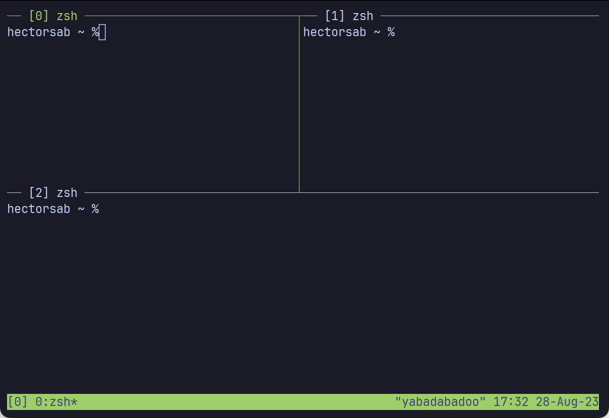
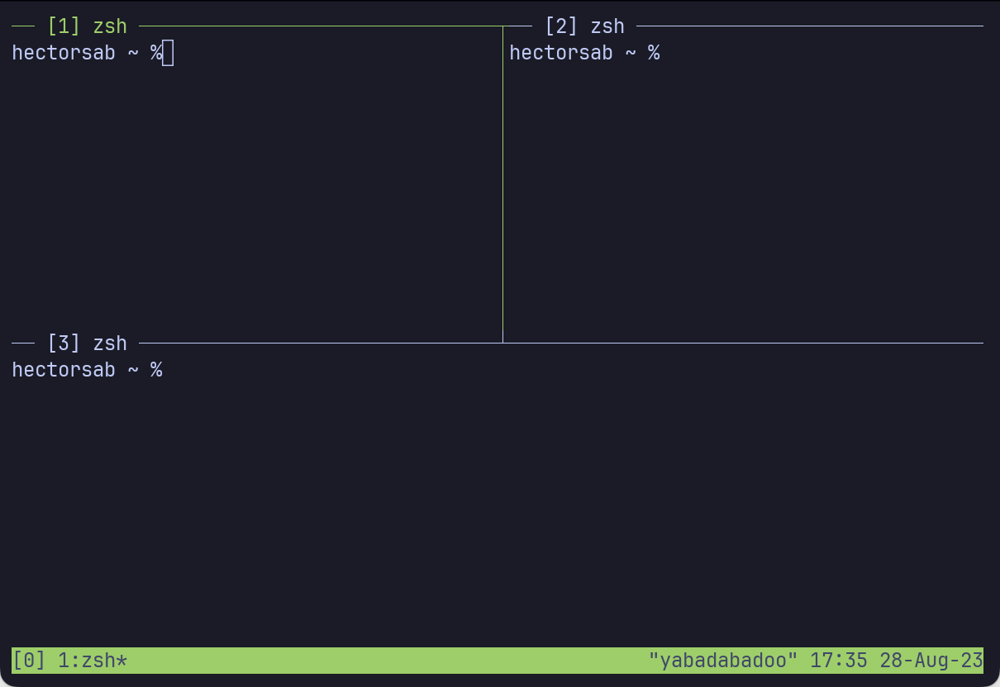

# Tmux 101
Welcome to tmux 101! In this guide I'll attempt to show you all the basics you need to feel comfortable
using tmux.

> **&#9432;** **NOTE:** The keyboard is the primary way of using tmux. If you are more interested on using
your mouse, keep reading as it's possible to some extend. However, I'd recommend letting go and embrase
your fingers. Lots of things will become easier once you have build enough muscle memory.

> **&#9432;** **NOTE 2:** If you are in MacOs, take a look at this [extra steps](MACOS.md).

## Installation
You can refer to the [tmux wiki](https://github.com/tmux/tmux/wiki/Installing) for the most up to date
information on how to install it on your system.

## Basics

#### Open tmux
Typing `tmux` and pressing `Enter` on a terminal should be enough to start tmux.
```bash
$ tmux
```

#### Create a window (a.k.a. tab)
Once inside tmux, it's possible to create windows/tabs. For that, you need to:
- press the key `control`
- without releasing `control`, press `b` and release both keys
- press `c`

Such keybinding is also expressed as below
```
C-b + c
```

You can achieve the same result by doing
```
C-b + :new-window
```

#### Rename a window
By default, the window is dynamically named after the command that it's running. If
we know already that we will dedicate a window to something in particular, it's possible
to rename it with the following command.
```
C-b + ,
```

#### Create panes
In case there's a need to see more than one terminal at the same time, it's possible
to make a vertical split using the keybinding below.
```
C-b + %
```

Prefer a horizontal split? Tmux got you.
```
C-b + "
```

#### Prefix
As you have seen, `C-b + <key>` for contorling tmux behavior. `C-b` (refered to as `Ctrl-b` in some places) is also
known as `<prefix>` and it can be configured to be anything.

> **&#9432;** **NOTE:** If you ask me, it's better to keep the default prefix.
This way you can use tmux on other systems without having to struggle with your
muscle memory.

#### Move across panes
Move up, down, left, or right using the arrows of your keyboard.
```
<prefix> + <arrow>
```

#### Move across windows
Move to the right, or next, window.
```
<prefix> + n
```

Move to the left, or previous, window.
```
<prefix> + p
```

Move to a specific window.
```
<prefix> + <number>
```

#### Sessions
Let's say that it's now time to work on a different project, but the current terminals
open are still of use. Instead of adding a new window, tmux is capable of creating new
sessions, or "fresh spaces". To make a new session

```
<prefix> + :new-session
```

It's also possible to assign a name
```
<prefix> + :new-session -s my-session-name
```

or to rename the current session.
```
<prefix> + :rename-session my-session-name
```

#### Change active session
```
<prefix> + s
```

or
```
<prefix> + :choose-session
```

#### Show pane title
Show pane titles
```
<prefix> + :set pane-border-status top
```

Change name of the pane
```
<prefix> + :select-pane -T my-pane-title
```

## Mouse mode
Enable the mouse mode by setting the `mouse` option to `on`. Now try right clicking around
the terminal to see what are the options. Hint: right click on the session indicator and
on the window names. You can also change the focused window/pane by clicking on them, or
resize panes by drag and droping their edges. Disable it by setting it to `off`.
```
# Turn mouse on
<prefix> + :set mouse on

# Turn mouse off
<prefix> + :set mouse off
```

## Quality of life
These are configurations I like to have setup.

#### Set index starting from 1
```
set -g base-index 1
set -g pane-base-index 1
```

  |  
:-------------------------:|:-------------------------:
Zero-base index             |  One-base index


> **&#9432;** **NOTE:** The session "index" shown when doing `<prefix> + s` cannot
be changed to be 1-based as what's shown is in reallity the session id, and the
maintainers seem to be unwilling to add an index here.

#### Attach to another session after closing last window
```
set -g detach-on-destroy no-detached
```

#### Disable bell sounds
```
set -g bell-action none
```

#### Create new windows with current working directory
```
bind c new-window -c "#{pane_current_path}"
```

#### Split panes with current working directory
```
bind '"' split-window -v -c "#{pane_current_path}"
bind % split-window -h -c "#{pane_current_path}"
```

#### Increase history
```
set -g history-limit 50000
```

## Custom quality of life
#### Custom pane titles
Bash scripts at `dotfiles/.local/bon`.
